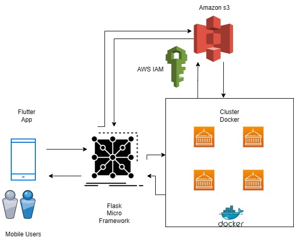
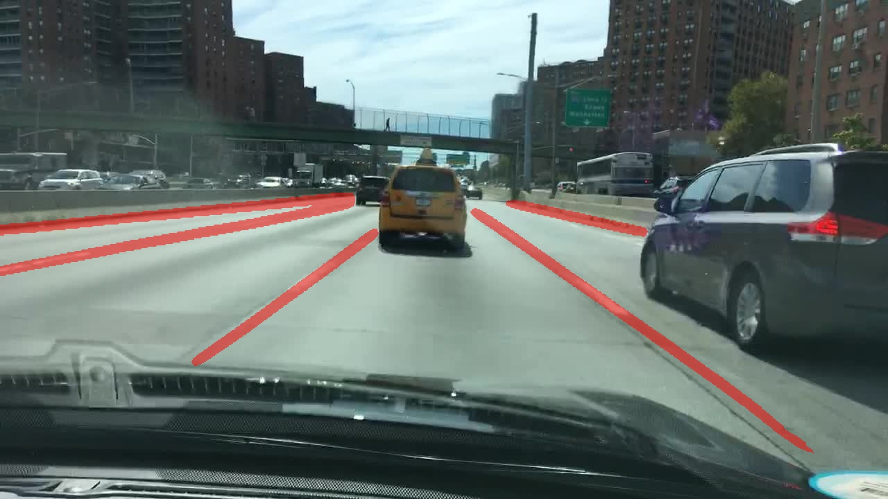

# Lane Detection and Viewing Service App Project -  Master of Computer Science @ University of Wollongong -
This Flask application provides an API for uploading images for object detection using YOLO, YOLO2, and UNet models.
As this is integrated with a Flutter app, userrs can easily capture or upload images and videos for processing against these detection models. 
Additionally, the app provides a feature to view the processed images or videos based on the selected model.

## How it Works 

## Setup

Ideally I reccommed to run this in a Linux enviroment, if running in windows using Docker Desktop would be helpful. 
NOTE: Docker, GIT and GIT LFS are pre-requisites.

1. Clone the repository:

   git clone https://github.com/KNrodrigo/LaneD-Models-App

2. Run the Docker Containers

   Docker compose up

## Endpoints

### Upload Image for Object Detection (YOLO)

- **URL:** `/detect/yolo/`
- **Method:** POST
- **Request Body:** Form-data with a file OR picture taken from the flutter app

### Upload Image for Object Detection (YOLO2)

- **URL:** `/detect/yolo2/`
- **Method:** POST
- **Request Body:** Form-data with a file OR picture taken from the flutter app

### Upload Image for Semantic Segmentation (UNET)

- **URL:** `/detect/unet/`
- **Method:** POST
- **Request Body:** Form-data with a file OR picture taken from the flutter app

### View Processed Images (YOLO)

- **URL:** `/view/yolo`
- **Method:** GET

### View Processed Images (YOLO2)

- **URL:** `/view/yolo2`
- **Method:** GET

### View Processed Images (UNET)

- **URL:** `/view/unet`
- **Method:** GET

## Authors

- **Dai Dong** 
- **Shu-YU**
- **Shazeb Gul** 
- **Sabbir Anwar**
- **Sami** 
- **Nawordth Rodrigo** 

## Examples

